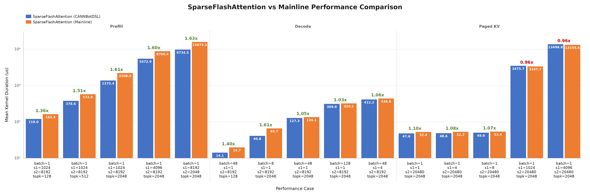

# Sparse Flash Attention

基于 CANNBot-DSL 实现的 Sparse Flash Attention（SFA）算子。通过
`sparse_indices` 为每个 Query 选择参与 attention 计算的 KV token，支持连续 KV、
TND 变长序列及 Paged KV cache。

## 算子介绍

Sparse Flash Attention 通过 `sparse_indices` 选择参与计算的 KV token。记选出的
Key 和 Value 为 $\widetilde K$、$\widetilde V$，标准稀疏 attention 的计算为：

$$
O = \operatorname{softmax}(Q\widetilde K^T\cdot scale)\widetilde V
$$

当前实现采用 MLA-absorb 模式，选中的 Key 同时作为 Value，即
$\widetilde V = \widetilde K$。

**不使用 RoPE 时：**

$$
O = \operatorname{softmax}(Q\widetilde K^T\cdot scale)\widetilde K
$$

**使用 RoPE 时：**

$$
O = \operatorname{softmax}\!\left(
(Q\widetilde K^T + Q_{\mathrm{rope}}\widetilde K_{\mathrm{rope}}^T)\cdot scale
\right)\widetilde K
$$

其中，$Q$、$\widetilde K$ 为 512 维 NoPE 数据，
$Q_{\mathrm{rope}}$、$\widetilde K_{\mathrm{rope}}$ 为对应的 64 维位置编码数据。

若传入 `sinks`，其值作为额外分数参与 softmax，分走部分注意力权重，
但不提供参与加权求和的数据。

## 快速开始

在仓库根目录执行：

```bash
pytest test/sparse_flash_attention/test_sparse_flash_attention.py -q
pytest test/sparse_flash_attention/test_sparse_flash_attention.py -q -o mode=eager
pytest test/sparse_flash_attention/test_sparse_flash_attention.py -q -o mode=aclgraph
```

下面给出一个 BSND、BF16 的完整示例：

```python
import math
import torch
import torch_npu

from sparse_flash_attention import sparse_flash_attention

B, S1, S2, N1, N2 = 1, 2, 16, 8, 1
D, DR, TOPK = 512, 64, 8
dtype = torch.bfloat16

query = torch.randn(B, S1, N1, D, dtype=dtype).npu()
query_rope = torch.randn(B, S1, N1, DR, dtype=dtype).npu()
key = torch.randn(B, S2, N2, D, dtype=dtype).npu()
key_rope = torch.randn(B, S2, N2, DR, dtype=dtype).npu()

# 每个 Query token 选择 TOPK 个逻辑 KV token。
sparse_indices = torch.tensor(
    [[[[0, 2, 4, 6, 8, 10, 12, 14]],
      [[1, 3, 5, 7, 9, 11, 13, 15]]]],
    dtype=torch.int32,
).npu()

output, softmax_max, softmax_sum = sparse_flash_attention(
    query=query,
    key=key,
    value=key,                 # MLA-absorb；当前 kernel 使用 key 参与 PV
    sparse_indices=sparse_indices,
    query_rope=query_rope,
    key_rope=key_rope,
    scale_value=1.0 / math.sqrt(D + DR),
    sparse_block_size=1,
    layout_query="BSND",
    layout_kv="BSND",
    sparse_mode=0,
    attention_mode=2,
    return_softmax_lse=True,
)

print(output.shape)       # (1, 2, 8, 512)
print(softmax_max.shape)  # (1, 1, 2, 8)
print(softmax_sum.shape)  # (1, 1, 2, 8)
```

## 接口说明

```python
sparse_flash_attention(
    query,
    key,
    value,
    sparse_indices,
    block_table=None,
    query_rope=None,
    key_rope=None,
    sinks=None,
    cu_seqlens_q=None,
    cu_seqlens_kv=None,
    seqused_q=None,
    seqused_kv=None,
    scale_value=1.0,
    sparse_block_size=1,
    layout_query="BSND",
    layout_kv="BSND",
    sparse_mode=0,
    pre_tokens=2**63 - 1,
    next_tokens=2**63 - 1,
    attention_mode=2,
    return_softmax_lse=False,
)
```

### 输入与属性

`query`、`key`、`value` 支持 `torch.float16` 或 `torch.bfloat16`，三者 dtype 必须一致；存在的 RoPE Tensor 必须与它们 dtype 一致。

| 参数 | 说明 |
| :--- | :--- |
| `query` | NoPE Query。BSND 为 `(B,S1,N1,512)`；TND 为 `(T1,N1,512)`；Query head 数 `N1` 为 1～128 |
| `key` | NoPE Key。BSND 为 `(B,S2,1,512)`；TND 为 `(T2,1,512)`；PA 为 `(block_num,block_size,1,512)`。KV head 数固定为 1；PA 的 `block_size` 为 16～1024，且必须是 16 的倍数 |
| `value` | 必传 Tensor，shape、dtype 与 `key` 相同；MLA-absorb 场景传 `value=key` |
| `sparse_indices` | INT32 稀疏逻辑 KV 索引，每个索引选择一个 KV token。BSND 为 `(B,S1,1,K)`；TND 为 `(T1,1,K)` |
| `block_table` | 仅 `PA_BSND` 使用，必传连续 INT32 Tensor，shape 为 `(B,max_blocks_per_seq)` |
| `query_rope` | 可选 Query RoPE。前缀维度与 `query` 相同，最后一维为 64 |
| `key_rope` | 可选 Key RoPE。前缀维度与 `key` 相同，最后一维为 64；必须与 `query_rope` 同时为 `None` 或同时传入 |
| `sinks` | 可选 FP32 Tensor，shape 为 `(N1,)`，每个 Query head 一个 sink logit |
| `cu_seqlens_q` | TND Query 必传，连续 INT32 Tensor，shape 为 `(B+1,)`，带前导 0 |
| `cu_seqlens_kv` | 仅 TND KV 可传且必传，连续 INT32 Tensor，shape 为 `(B+1,)`，带前导 0；PA 场景不能传入 |
| `seqused_q` | 可选有效 Q 长度，连续 INT32 Tensor，shape 为 `(B,)` |
| `seqused_kv` | 可选有效 KV 长度，连续 INT32 Tensor，shape 为 `(B,)`；PA 必传 |
| `scale_value` | QK score 的缩放系数；有 RoPE 通常为 `1/sqrt(576)`，无 RoPE 通常为 `1/sqrt(512)` |
| `sparse_block_size` | 固定为 1 |
| `layout_query` | `BSND` 或 `TND` |
| `layout_kv` | `BSND`、`TND` 或 `PA_BSND`；支持的 Query/KV layout 组合为 `BSND/BSND`、`BSND/PA_BSND`、`TND/TND`、`TND/PA_BSND` |
| `sparse_mode` | 0：无 causal 限制；3：right-down causal |
| `pre_tokens` | 仅支持默认值 `2^63-1` |
| `next_tokens` | 仅支持默认值 `2^63-1` |
| `attention_mode` | 固定为 2，表示 MLA-absorb 模式 |
| `return_softmax_lse` | 是否返回 softmax 的 max、sum 中间统计量；`PA_BSND` 必须为 `False` |

### 返回值

函数固定返回三元组：

```python
(attention_out, softmax_max, softmax_sum)
```

| 返回值 | dtype 与 shape |
| :--- | :--- |
| `attention_out` | dtype、shape 与 `query` 相同，最后一维为 512 |
| `softmax_max` | FP32；BSND 为 `(B,1,S1,N1)`，TND 为 `(1,T1,N1)` |
| `softmax_sum` | FP32；shape 与 `softmax_max` 相同 |

当 `return_softmax_lse=False` 时，`softmax_max` 和 `softmax_sum` 是 NPU 上的空 FP32
Tensor。返回的是在线 softmax 的 max 和 sum，并非单独计算好的
`log(sum(exp(x))) + max`。

## 当前功能矩阵

| 用例 | 场景 | 主要覆盖 |
| :--- | :--- | :--- |
| `test_f01_bsnd_fp16_baseline` | BSND/BSND、FP16、RoPE、mode 0 | 不等长 Q/KV、输出及 stats |
| `test_f02_full_length_without_rope_or_lengths` | BSND/BSND、BF16、无 RoPE | 全长输入，`seqused_q/kv=None` |
| `test_f03_tnd_causal_sinks` | TND/TND、mode 3、sinks | 不等长 segment、因果边界及 stats |
| `test_f04_paged_kv` | BSND/PA_BSND、page size 128 | 乱序物理页，索引跨两个 page |
| `test_f05_tnd_paged_bf16` | TND/PA_BSND、BF16、mode 3 | 混合布局、sinks |
| `test_f06_head_group_split_over_64` | N1=128 | 多 head chunk 分核 |
| `test_f07_nonpow2_heads_multitile` | N1=33、K=129 | head 尾块与跨 128-token 稀疏 tile |
| `test_f08_min_sparse_count` | K=1、mode 3 | 单 token、单块收尾 |
| `test_f09_empty_rows` | 索引全为 `-1` | 空行、因果提前退出、sinks 与零输出 |
| `test_f10_multitile_determinism` | K=129、非零 scale | 多块流水及两次执行逐元素一致 |

## 性能对比



上图展示 15 条代表性用例的 DSL 与主线 Kernel 平均耗时，纵轴采用
对数刻度。Prefill、Decode、Paged KV 各 5 条，组内按 DSL 平均耗时升序排列；
每组柱顶标注 `主线 / DSL` 比率，大于 1 表示 DSL 更快。

| 用例 | 主要覆盖 | batch | s1 | s2 | topk | g | 主线/DSL 平均 Kernel 比率 |
| :--- | :--- | ---: | ---: | ---: | ---: | ---: | ---: |
| `prefill_topk_128` | 短稀疏列表 | 1 | 1024 | 8192 | 128 | 64 | 1.3562 |
| `prefill_topk_512` | 中等长度稀疏列表 | 1 | 1024 | 8192 | 512 | 64 | 1.5133 |
| `prefill_base` | 常规 prefill | 1 | 1024 | 8192 | 2048 | 64 | 1.6059 |
| `prefill_s1_4096` | 较长 Query prefill | 1 | 4096 | 8192 | 2048 | 64 | 1.6043 |
| `prefill_s1_8192_s2_2048` | 长 Query、因果边界 | 1 | 8192 | 2048 | 2048 | 64 | 1.6306 |
| `decode_topk_128` | 极短 decode Kernel | 48 | 1 | 8192 | 128 | 64 | 1.3980 |
| `decode_batch_8` | 小 batch decode | 8 | 1 | 8192 | 2048 | 64 | 1.6112 |
| `decode_base` | 常规短 decode | 48 | 1 | 8192 | 2048 | 64 | 1.0532 |
| `decode_batch_128` | 大 batch decode | 128 | 1 | 8192 | 2048 | 64 | 1.0331 |
| `decode_s1_4` | 多 Query token decode | 48 | 4 | 8192 | 2048 | 64 | 1.0593 |
| `network_case` | PA decode、page size 128 | 1 | 1 | 20480 | 2048 | 128 | 1.1023 |
| `network_case_s1_4` | PA decode、4 个 Query token | 1 | 4 | 20480 | 2048 | 128 | 1.0842 |
| `network_case_s1_8` | PA decode、8 个 Query token | 1 | 8 | 20480 | 2048 | 128 | 1.0712 |
| `pa_prefill_s1_1024` | PA prefill、1024 个 Query token | 1 | 1024 | 20480 | 2048 | 128 | 0.9632 |
| `pa_prefill_s1_4096` | PA prefill、4096 个 Query token | 1 | 4096 | 20480 | 2048 | 128 | 0.9603 |

性能测试先对两种实现做精度检查，再分别预热 3 次，使用 NPU Profiler 采集
10 次目标 SFA Kernel，以平均耗时计算主线与 DSL 的比率。输入构造、CPU
参考计算和首次 JIT 编译不计入 Kernel 时间。

上述 15 条性能用例也收录在 `test/sparse_flash_attention/test_sparse_flash_attention.py`
中，仅执行精度检查，不计时：短 Query 检查全部 batch 和 Query；大 prefill
抽查首尾、中间位置及因果边界的全部 head，并检查完整输出的
shape、dtype 和有限性。

## 当前限制

- 仅支持 Ascend 950PR / Ascend 950DT 对应的 ARCH35 路径；
- 不支持 BNSD；
- 不支持 N2 大于 1；
- 仅支持 token 级稀疏索引（`sparse_block_size=1`），不支持按块选择多个 KV token；
- 不支持滑动窗口或自定义 `pre_tokens`、`next_tokens`；
- PA 暂不返回 softmax max/sum；
- `value` 不提供独立语义，MLA-absorb 输出使用 `key`；

## 优化方向

### 1. 基于 metadata 的任务调度与 KV 分核

引入 `sparse_flash_attention_metadata`，在 AICPU 上根据有效 Query 长度与
稀疏 KV 工作量进行分核处理，生成任务分片信息。对于短 Query、长稀疏 KV
列表的 decode 场景，采用 Split-KV 将同一 Query 的稀疏 KV 列表分配到多个
计算核并行处理，再基于局部 softmax max/sum 归并输出。

通过上述调度提升核利用率与变长输入的负载均衡，同时根据有效稀疏长度选择
分片粒度，控制 AICPU 调度、局部结果存储及归并开销。

### 2. KV 稀疏索引的向量化处理与 gather 优化

对 `sparse_indices` 进行向量化处理，批量完成有效索引掩码、因果条件判断
与 KV 地址计算；Paged KV 场景同时处理逻辑页号、页内偏移及 `block_table`
映射。结合 DSL 与硬件支持，采用向量化索引访问或批量 gather，减少逐 token
的标量处理开销，提高 KV 数据准备效率。

实现时需处理 `-1` 尾部填充与尾块，并结合索引分布、访存粒度评估收益。
