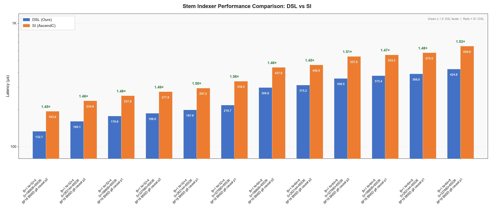

# Stem Indexer

基于 CANNBotDSL 实现的稀疏 Attention 选块算子，根据 Q/K 块级特征和 Value 量值偏置计算分数，
通过动态 TopK 选择 Key Block，输出块索引和有效长度，面向 Ascend NPU。

## 算子介绍

计算公式：

$$
S_{b,h,i,j}=\frac{Q_{b,h,i}\cdot K_{b,\lfloor h/G\rfloor,j}^{T}}{(B_s/T_s)^2}
+\mathrm{bias}_{b,\lfloor h/G\rfloor,j},\qquad G=N_q/N_k
$$

$$
\mathrm{indices}_i=\mathrm{Sink}_i\mathbin{\Vert}
\operatorname{TopK}(S_i,\widehat K_i)\mathbin{\Vert}\mathrm{Window}_i
$$

输入为上游已聚合、展平的块级特征，不是原始 token Q/K；本算子不执行 Softmax 或 Attention 加权求和。
`stem_block_size=128`、`stem_stride=16` 时，块级特征维度为 2048，分数缩放系数为 `1/64`。
TopK 候选不包含强制保留的 Sink/Window，输出索引不重复。

| 特性与约束 | 说明 |
| :--- | :--- |
| 数据类型 | Q/K 为 bfloat16，bias 为 float32；输出索引和长度为 int32 |
| Layout | Q/K 为 BNSD 块级特征：`[B,N,Qmax或Kmax,2048]` |
| Batch | `1 ≤ B ≤ 65536`，同时受设备内存容量限制 |
| GQA | `Nq ∈ {32,64}`、`Nk ∈ {2,4,8}`，且 Nq 须为 Nk 的整数倍 |
| 块参数 | `stem_block_size=128`、`stem_stride=16` |
| 稀疏策略 | 支持 Right-down Causal、非 causal、固定 Sink/Window 和 Position-Decay |
| 固定保留块 | `initial_blocks=4`、`window_size=4` |
| 排序精度 | p1：FP32 分数 / UINT32 key；p2：BF16 分数 / UINT16 key；全局索引均为32位 |
| 动态预算 | `0 < alpha ≤ 1`，每行普通 TopK 最多256项，不包括 Sink/Window |
| 支持架构 | NPU ARCH 3510（Ascend 950PR / Ascend 950DT） |

实现详见 [stem_indexer.py](stem_indexer.py)。调用前使用独立的
[stem_indexer_metadata](stem_indexer_metadata.py) AICPU 算子生成 metadata。

### 可见范围与动态预算

令 $Q_b=\lceil L_b^q/128\rceil$、$K_b=\lceil L_b^k/128\rceil$、
$P_b=\lceil L_b^p/128\rceil$，分别表示有效 Q、K 和 prompt 的块数。
causal 模式下，第 $i$ 个 Q block 的可见 K block 数为
$v_i=\operatorname{clamp}(K_b-Q_b+i+1,0,K_b)$；非 causal 或 Q token 长度为1的 decode 场景取 $v_i=K_b$。

强制保留前 `min(4, v_i)` 个 Sink block 和末尾最多4个 Window block，两者不重叠。
其余可见块作为 TopK 候选；候选全部需要保留时，直接输出可见索引。

Position-Decay 初始预算为：

$$
K_s=\begin{cases}
P_b,&P_b<56,\\
\lfloor0.2P_b+30\rfloor,&56\le P_b<160,\\
\lfloor0.1P_b+30\rfloor,&P_b\ge160.
\end{cases}
$$

令 $p_i=i+K_b-Q_b$、$\Delta=P_b-K_s$。若 $p_i<K_s$ 或 $\Delta\le1$，取 $K_i=K_s$；否则：

$$
K_i=\operatorname{clamp}\left(
\left\lfloor K_s+\frac{p_i-K_s}{\Delta-1}(\alpha K_s-K_s)\right\rfloor,1,K_s\right),
\qquad\widehat K_i=\min(K_i,256,\text{候选块数}).
$$

`alpha=1` 表示预算不衰减。调用方应依赖有效索引集合和长度，不依赖 TopK 内部排列或同分元素顺序。

## 快速开始

安装 CANNBotDSL、PyTorch 和 torch_npu 后，在仓库根目录执行：

```bash
source /home/<user>/Ascend/cann/set_env.sh
export PYTHONPATH="$PWD/samples/stem_indexer:$PYTHONPATH"
```

```python
import torch
import torch_npu
from stem_indexer import FixedAttributes, stem_indexer
from stem_indexer_metadata import stem_indexer_metadata

B, Nq, Nk, Qmax, Kmax, Df = 1, 32, 4, 16, 64, 2048
q = torch.randn(B, Nq, Qmax, Df, dtype=torch.bfloat16).npu()
k = torch.randn(B, Nk, Kmax, Df, dtype=torch.bfloat16).npu()
bias = torch.randn(B, Nk, Kmax, dtype=torch.float32).npu()
q_seq_lens = torch.full((B,), Qmax * 128, dtype=torch.int32).npu()
kv_seq_lens = torch.full((B,), Kmax * 128, dtype=torch.int32).npu()
num_prompt_tokens = kv_seq_lens.clone()

metadata = stem_indexer_metadata(
    q_seq_lens, kv_seq_lens, Nq, Nk,
    causal=True, stem_block_size=128, window_size=4, dim_qkflat=Df,
)
sparse_indices, sparse_seq_len = stem_indexer(
    q, k, bias, q_seq_lens, kv_seq_lens, num_prompt_tokens,
    attrs=FixedAttributes(causal=True, alpha=1.0, topk_score_precision=2),
    metadata=metadata,
)
torch.npu.synchronize()
# sparse_indices: [1, 32, 16, 64], int32
# sparse_seq_len: [1, 32, 16], int32
```

`stem_indexer()` 关键参数：

| 参数 | 默认值 | 说明 |
| :--- | :---: | :--- |
| `q` | — | BF16 Q 块级特征，shape `(B, Nq, Qmax, 2048)` |
| `k` | — | BF16 K 块级特征，shape `(B, Nk, Kmax, 2048)` |
| `bias` | — | FP32 Value 量值偏置，shape `(B, Nk, Kmax)` |
| `q_seq_lens` | — | INT32 `(B,)`，逐 batch Q token 长度，范围 `[0, Qmax * 128]` |
| `kv_seq_lens` | — | INT32 `(B,)`，逐 batch K token 长度，范围 `[0, Kmax * 128]` |
| `num_prompt_tokens` | — | INT32 `(B,)`，逐 batch prompt token 数，须不小于对应 K 长度 |
| `attrs.causal` | `True` | 是否使用 Right-down Causal |
| `attrs.stem_block_size / stem_stride` | `128 / 16` | 固定块参数 |
| `attrs.alpha` | `1.0` | 有限衰减参数，范围 `(0, 1]` |
| `attrs.initial_blocks / window_size` | `4 / 4` | 固定 Sink/Window 块数 |
| `attrs.topk_score_precision` | `2` | 1：FP32 分数；2：BF16 分数 |
| `metadata` | `None` | 必须显式传入独立 AICPU 算子生成的 INT32 NPU Tensor |
| `block_dim` | `None` | 默认查询当前设备/流可用 Cube 核数；可显式指定，但不超过可用核数和布局上限36 |
| 返回值 `sparse_indices` | — | INT32 `(B, Nq, Qmax, Kmax)`，K block 逻辑索引，无效位置为 `-1` |
| 返回值 `sparse_seq_len` | — | INT32 `(B, Nq, Qmax)`，各行有效索引数，无效 Q 行为0 |

长度参数为逐 batch token 数，不是 block 数或前缀和。Q/K 块容量须大于0。
非连续输入由入口转为连续 Tensor；调用前应选择目标 NPU，metadata 与长度输入须位于该设备。
Host 仅校验 shape、dtype 和属性规格，不读取设备 Tensor 的值；调用方应保证长度值符合上述范围。
metadata 的长度、head、causal、窗口和核数须与主算子一致；显式指定 `block_dim` 时两次调用都要传入。
输出保留输入容量，仅 `sparse_indices[b,h,i,:sparse_seq_len[b,h,i]]` 有效；请预留输入、输出和工作区内存。

## 精度测试

测试脚本位于 [test/stem_indexer/test_stem_indexer.py](../../test/stem_indexer/test_stem_indexer.py)，需在 NPU 环境下运行。

```bash
python -m pytest test/stem_indexer/test_stem_indexer.py -v
```

包含8个代表性 case，比对 PyTorch reference，覆盖以下场景：

- **排序精度**：p1（UINT32 key）、p2（UINT16 key）。
- **稀疏策略**：causal、非 causal、不同 Position-Decay 系数。
- **输入形状**：不同 GQA head 配置、变长 batch、非整块长度和长序列。
- **边界处理**：零 TopK、有效索引范围、输出长度、Sink/Window 和 TopK 边界分数。

TopK 边界分数采用相对容差 `1e-3`、绝对容差 `2.5e-5`；超出边界容差的差异数量
最多占全部有效输出元素的 `0.5%`。结构性错误不适用该容差。

## 性能对比



Stem Indexer (CANNBot-DSL) 与 SI (AscendC) 在 12 个典型 case 上的性能对比（msprof 采集，按 Stem Indexer 耗时升序排列）。
